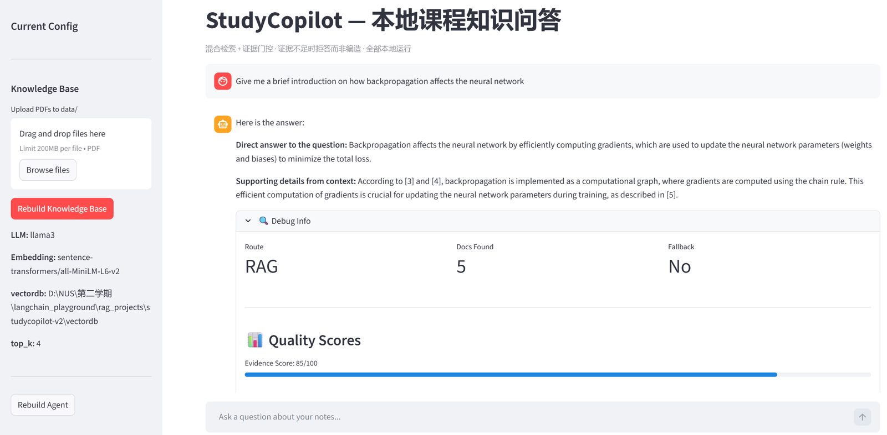
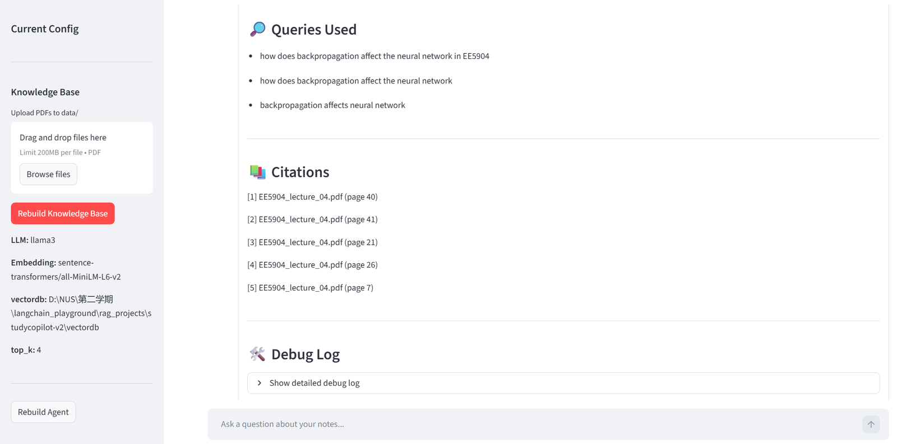
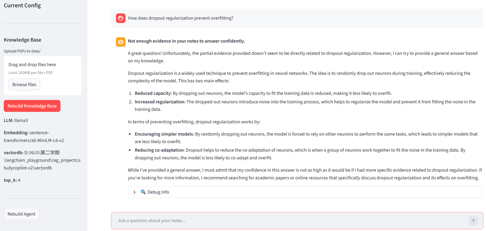

# StudyCopilot

**A local RAG assistant for course notes — built to abstain, not to fabricate.**

> 📖 **中文版在英文版之后** · Chinese version follows the English version



*Answers are structured as direct conclusion → supporting context, with inline `[3]` `[4]` `[5]` citation markers. The debug panel exposes the routing decision (RAG), documents retrieved (5), and the evidence score (85/100).*

*回答按「直接结论 → 上下文佐证」组织，正文内嵌引用标号；Debug 面板显示路由决策、召回证据数与证据评分。*



*Top: the three retrieval queries actually issued for this question — the original, a course-contextualised rewrite, and a keyword-reduced form. Bottom: the full source list, each entry naming file and page so it can be checked against the original PDF.*

*上：本次实际执行的三条检索 query（原问题 / 加课程上下文的改写 / 关键词化）。下：完整来源列表，标注文件名与页码。*



*The same system asked about a topic the slides never cover — `dropout` has zero hits across all 584 chunks. The evidence gate blocks generation, the reply opens with **"Not enough evidence in your notes to answer confidently"**, and the general knowledge that follows is explicitly flagged as coming from outside the notes. No citations are fabricated.*

*同一系统被问到讲义完全未覆盖的主题 —— `dropout` 在 584 个 chunk 中零命中。证据门阻断生成，回答以「笔记中证据不足」开头，其后补充的通用知识明确标注为笔记之外的来源，且不伪造任何引用。*

---

# ======= ENGLISH VERSION =======

## 1. Overview

StudyCopilot turns a course's lecture PDFs into a private, queryable knowledge base. Its central trade-off is explicit: **it would rather refuse than invent.**

- **Hybrid retrieval** — dense vectors for semantic recall, BM25 for exact keyword matches, FlashRank cross-encoder for reranking
- **Post-retrieval routing** — evidence is fetched *first*, then used to decide whether the knowledge base or general knowledge should answer, instead of guessing from the question text
- **Evidence gating** — when retrieved evidence scores below threshold, generation is blocked and the user is told the notes do not cover it
- **Verifiable citations** — every answer names its source file and page, so any claim can be traced back to the slide it came from
- **Fully local** — the LLM runs through Ollama, vectors live in Chroma; lecture material never leaves the machine

It ships with an evaluation suite that **does not rely on LLM self-grading**: a 31-question stratified test set plus a deterministic faithfulness audit.

## 2. Why This Exists

Asking a general-purpose LLM about course material fails in three ways: answers cannot be traced back to the slides, the model confidently invents content the course never covered, and asking in Chinese against English slides gives unstable recall.

This project optimises for **verifiability over fluency**. Every answer carries page-level citations, and when evidence is thin the system says so instead of producing something that merely sounds plausible.

## 3. Architecture

```
User question
   │
   ├─ Gate 1   Quick pre-retrieval (top-2, dense only)
   │             └─ Post-retrieval routing: decide RAG / NO_RAG after seeing
   │                evidence, not by guessing from the question alone
   │
   ├─ Deep retrieval   ReAct multi-step loop
   │             ├─ Query rewrite   → conversational phrasing to search terms
   │             ├─ Query refine    → multiple candidates, better cross-lingual recall
   │             ├─ Hybrid search   → dense vectors + BM25
   │             ├─ FlashRank       → cross-encoder reranking
   │             └─ Cross-round evidence merged with deduplication
   │
   ├─ Gate 2   Evidence scoring (0-100)
   │             └─ Below threshold → block generation, fall back and state the source
   │
   └─ Generation   Constrained prompt: CONTEXT only, mandatory [n] citations,
                   language alignment
```

### Key design decisions

**Post-retrieval routing.** Retrieve first, decide second. Judging "do my notes cover this?" from the question text alone is unreliable — the model has never seen what is in the index.

**Cross-round evidence accumulation.** Each ReAct round merges its results by `(source, page, content prefix)` rather than replacing them. An earlier version kept whichever round returned more documents, which meant new evidence from later rounds was discarded wholesale unless it happened to be larger — making multi-step retrieval effectively pointless.

**Layered abstention.** Hard length threshold → evidence-score gate → prompt-level constraint at generation. Any one of the three triggers refusal rather than fabrication.

## 4. Quick Start

### 4.1 Environment

```bash
conda create -n studycopilot python=3.10
conda activate studycopilot
pip install -r requirements.txt
```

### 4.2 Ollama

```bash
# Install from https://ollama.com
ollama pull llama3
ollama serve          # defaults to http://127.0.0.1:11434
```

### 4.3 Add your lecture notes

Drop PDFs into `data/`, then build the index:

```bash
python src/ingest.py
```

> Both `data/` PDFs and `vectordb/` are gitignored — this repository ships no lecture content.

### 4.4 Run

```bash
streamlit run src/app.py        # opens on localhost:8501
```

PDFs can also be uploaded and the knowledge base rebuilt from within the UI.

## 5. Evaluation

This is where most of the engineering effort went. **No metric here depends on LLM self-grading.**

### 5.1 Test set

`evaluate/eval_questions.json`, 31 questions:

| Category | Count | Notes |
|---|---:|---|
| `in_scope` | 15 | Genuinely covered by the slides (one in Chinese, for cross-lingual testing) |
| `out_of_scope` | 15 | Genuinely absent from the slides, split across three difficulty tiers |
| `ambiguous` | 1 | Topic present, specific detail possibly missing |

The three `out_of_scope` tiers:

- **Easy** (3) — unrelated domains: World Cup, capital of France
- **Medium** (8) — same field, never taught: ResNet, dropout, BatchNorm, BERT, SVM, autoencoder, GAN
- **Hard** (4) — adjacent topic, missing specifics: SLAM (the corpus has LiDAR and Kalman but no SLAM), RRT, course admin details, a page number that does not exist

Every `out_of_scope` question's key entity was **independently verified against corpus term frequency**, with the evidence recorded in each question's `note` field. This step proved necessary: an initial draft classified Transformer, LSTM, Adam, CNN, Q-learning, Kalman and LiDAR as "not covered" — term-frequency checks showed **all of them are in the corpus**. Skipping verification would have produced a large number of mislabelled ground-truth entries.

### 5.2 Running it

```bash
python src/evaluate.py                                   # run the evaluation
python src/faithfulness.py evaluate/eval_results_*.jsonl # deterministic audit
```

`evaluate.py` reports a refusal confusion matrix, refusal rate broken down by difficulty tier, retrieval quality, routing distribution and a cross-lingual split. It also stores `answer`, `context` and `citations` so results can be audited after the fact.

`faithfulness.py` calls no LLM at all. It does two things:

1. **Citation validity** — are all `[n]` markers in the answer within the range of documents actually retrieved?
2. **Entity assertion detection** — for entities absent from the corpus, does the answer *assert* something about them, or *deny* having evidence?

## 6. Results

Setup: llama3 8B via Ollama + all-MiniLM-L6-v2 + 6 course PDFs (584 chunks)

### 6.1 Retrieval quality

| Metric | Before | Current |
|---|---:|---:|
| Average evidence retrieved | 2.35 docs | **5.65 docs** |
| Retrieval success rate | 58.8% | **94.1%** |

> Same 17-question test set. Note the corpus also grew from 3 PDFs to 6 over the same period, so this comparison carries a confound. The unconfounded evidence: the old merge logic capped `docs_found` at 4 by construction, and 12 of 17 questions now exceed that.

### 6.2 Hallucination control (31-question set)

| Metric | Value | Basis |
|---|---:|---|
| Citation fabrication rate | **0%** (0/31) | Fully deterministic, no human judgement |
| Refusal rate, unrelated domains | **100%** (3/3) | Easy tier |
| Correct abstention, out-of-corpus topics | **85.7%** (12/14) | Includes soft refusals; needs human confirmation |
| Measured hallucination rate | **14.3%** (2/14) | Human-audited |

> Small sample. Two events out of fourteen gives a 95% confidence interval of roughly **[4%, 40%]** — not enough to claim the system beats any particular threshold.

**The two hallucinations:**

- **autoencoder** — `autoencoder` / `encoder` / `decoder` / `latent` have zero corpus hits; the model answered from parametric memory and attached genuine page citations
- **SLAM** — subtler. It wrapped a concept absent from the corpus in terminology that genuinely is present: LiDAR, Kalman, sensor fusion

Root cause: the evidence scorer rates **topical relevance**, not **entity coverage**.

## 7. Known Limitations

**1. The formulas in these slides are not text.** Across the 183 pages of Lecture 02, mathematical symbols total **six characters**. Formulas and diagrams are vector graphics, so text extraction yields fragments:

```
"Perceptron: application to classification problem  class 1:  class 2:  decision boundary:"
```

An A/B test against PyMuPDF produced near-identical output (-0.2% characters), so **switching extractors does not help**. This makes some derivation questions unanswerable from text alone and is the main source of current false refusals. The way forward is multimodal ingestion, which is outside this project's current scope.

**2. Evidence scoring from an 8B model is unstable.** Questions whose content is abundantly present occasionally score low — sigmoid appears 69 times in the corpus, yet one run scored it 6/100.

**3. Cross-lingual answers mix languages.** The prompt constraint `Do NOT mix languages` is not reliably obeyed.

**4. Query decomposition and self-verification are implemented but disabled by default** (see `src/config.py`):

- Decomposition costs roughly 3x more while its sub-question evidence gets discarded during final context truncation — a net loss
- Self-verification returns 70 when JSON parsing fails, and the threshold is also 70, so the gate always passed

Both retain their code and feature flags; fixing the underlying issues re-enables them with a one-line change.

**5. The deterministic audit only covers questions with a known missing entity.** Open-domain in-scope hallucination detection needs NLI or an LLM judge, which is the next stage.

## 8. Project Structure

```
src/
  app.py            Streamlit interface
  agent.py          Main pipeline: routing / ReAct / evidence gating / generation
  chat.py           Hybrid retrieval: dense + BM25 + FlashRank
  query_rewrite.py  Query rewriting
  query_refine.py   Multi-candidate query expansion
  ingest.py         PDF cleaning, chunking, indexing
  loaders.py        Document loading
  rag_core.py       Context formatting and citation construction
  config.py         Central configuration
  evaluate.py       Evaluation driver
  faithfulness.py   Deterministic faithfulness audit (no LLM)
evaluate/
  eval_questions.json    31-question test set
  eval_metrics_*.json    Evaluation metrics
data/                    Course PDFs (gitignored)
vectordb/                Chroma persistence (gitignored)
```

## 9. Evolution

**Initial** — hybrid retrieval (dense + BM25 + FlashRank) with a boolean evidence gate

**Agent introduced** — ReAct multi-step retrieval loop, Streamlit interface, local LLM deployment

**Current** — routing moved to post-retrieval; evidence gate changed from boolean to 0-100 scoring; cross-round evidence loss in ReAct fixed; evaluation rebuilt on deterministic methods that do not rely on LLM self-grading

> On rebuilding the evaluation: earlier versions had the LLM score its own answers. Across every historical run, whenever parsing succeeded `faithfulness` was **always 1** and `hallucination` **always 0** — the grader never once returned a negative judgement, so the metric measured nothing. The current system uses a refusal-behaviour confusion matrix plus deterministic citation and entity checks, and its results are reproducible.

---

# ======= 中文版本 =======

## 1. 概述

StudyCopilot 把一门课的讲义 PDF 变成可问答的私有知识库。它的取舍很明确：**宁可拒答，也不编造。**

- **混合检索** —— Dense 向量召回语义相近内容，BM25 补上关键词精确匹配，FlashRank 交叉编码器重排
- **后检索路由** —— 先取回证据再判断该走知识库还是通用知识，而不是仅凭问题文本猜测
- **证据门控** —— 检索到的证据打分低于阈值时阻断生成，明确告知用户「笔记里没有」
- **可核查引用** —— 每条回答标注来源文件与页码，可翻回原始 PDF 核对
- **全本地运行** —— LLM 走 Ollama，向量库用 Chroma，讲义不出本机

配套一套**不依赖 LLM 自评**的评测体系：31 题分层评测集 + 确定性 faithfulness 审计。

## 2. 为什么做这个

用通用大模型问课程内容有三个问题：答案无法追溯到讲义原文、模型会自信地编造课件里没有的内容、中文提问检索英文讲义时召回不稳。

本项目的取向是**可核查优先于流畅**：每条回答带页码引用，证据不足时明确拒答并告知来源，而不是硬编一个看起来合理的答案。

## 3. 架构

```
用户问题
   │
   ├─ Gate 1  快速预检索 (top-2, 纯向量)
   │            └─ 后检索路由：拿到证据再决定 RAG / NO_RAG
   │               （而非仅凭问题文本猜测）
   │
   ├─ 深度检索  ReAct 多步循环
   │            ├─ Query Rewrite  → 口语转检索词
   │            ├─ Query Refine   → 多候选扩展，提升跨语言召回
   │            ├─ 混合检索       → Dense 向量 + BM25 关键词
   │            ├─ FlashRank      → cross-encoder 重排
   │            └─ 跨轮证据去重累加
   │
   ├─ Gate 2  证据打分 (0-100)
   │            └─ 低于阈值 → 阻断生成，走 fallback 并声明来源
   │
   └─ 生成     受约束提示：仅用 CONTEXT、强制 [n] 引用、语言对齐
```

### 关键设计

**后检索路由**：先检索再判断走向。仅凭问题文本判断「笔记里有没有」是不可靠的 —— 模型没看过库里的内容。

**跨轮证据累加**：ReAct 每轮检索结果按 `(source, page, 内容前缀)` 去重后合入，而不是整批替换。早期版本用「谁多用谁」的替换策略，导致后续轮次检索到的新证据只要条数不占优就被整批丢弃，多步检索形同虚设。

**分层拒答**：硬长度阈值 → 证据打分门控 → 生成阶段的提示约束。三层任一触发都会导致拒答而非编造。

## 4. 快速开始

### 4.1 环境

```bash
conda create -n studycopilot python=3.10
conda activate studycopilot
pip install -r requirements.txt
```

### 4.2 Ollama

```bash
# 安装：https://ollama.com
ollama pull llama3
ollama serve          # 默认 http://127.0.0.1:11434
```

### 4.3 准备讲义

把 PDF 放进 `data/`，然后建立索引：

```bash
python src/ingest.py
```

> `data/` 下的 PDF 与 `vectordb/` 均已在 `.gitignore` 中，仓库不包含任何讲义内容。

### 4.4 启动

```bash
streamlit run src/app.py        # 浏览器访问 localhost:8501
```

界面内也可上传 PDF 并一键重建知识库。

## 5. 评测体系

这是本项目投入最多的部分。**所有指标不依赖 LLM 自评。**

### 5.1 评测集

`evaluate/eval_questions.json`，31 题分层设计：

| 类别 | 数量 | 说明 |
|---|---:|---|
| `in_scope` | 15 | 讲义确实覆盖的内容（含 1 道中文，测跨语言） |
| `out_of_scope` | 15 | 讲义确实没有的内容，分三档难度 |
| `ambiguous` | 1 | 主题在库但细节可能缺失 |

`out_of_scope` 三档：

- **易**（3 题）完全无关领域 —— 世界杯、法国首都
- **中**（8 题）同领域但未覆盖 —— ResNet、dropout、BatchNorm、BERT、SVM、autoencoder、GAN
- **难**（4 题）主题邻近但内容缺失 —— SLAM（库里有 LiDAR/Kalman 但没有 SLAM）、RRT、课务信息、不存在的页码

每道 `out_of_scope` 题的核心实体都经**语料词频独立验证**确认不存在，验证依据写在题目的 `note` 字段里。这一步很必要：初版选题时曾把 Transformer、LSTM、Adam、CNN、Q-learning、Kalman、LiDAR 判为「未覆盖」，实际词频核对后发现它们**都在库里**，若不核对会产生大量错误标注。

### 5.2 运行

```bash
python src/evaluate.py                                   # 跑评测
python src/faithfulness.py evaluate/eval_results_*.jsonl # 确定性审计
```

`evaluate.py` 输出拒答混淆矩阵、按难度档拆分的拒答率、检索质量、路由分布、跨语言拆分，并把 `answer` / `context` / `citations` 一并存档以支持事后审计。

`faithfulness.py` 不调用任何 LLM，做两件事：

1. **引用有效性** —— 答案里的 `[n]` 是否都落在真实检索到的编号范围内
2. **实体断言检测** —— 对语料中不存在的实体，答案是「断言」还是「否认」

## 6. 实测结果

环境：llama3 8B (Ollama) + all-MiniLM-L6-v2 + 6 个课程 PDF（584 chunks）

### 6.1 检索质量

| 指标 | 重构前 | 当前 |
|---|---:|---:|
| 平均证据召回量 | 2.35 条 | **5.65 条** |
| 检索成功率 | 58.8% | **94.1%** |

> 同为 17 题评测集。需注意语料同期由 3 个 PDF 扩充至 6 个，该对比存在混淆因素。无混淆的证据：重构前证据合并逻辑的上限就是 4 条，而当前 12/17 题的 `docs_found > 4`。

### 6.2 幻觉控制（31 题集）

| 指标 | 数值 | 口径 |
|---|---:|---|
| 引用编造率 | **0%** (0/31) | 完全确定性，无人工判断 |
| 完全无关领域拒答率 | **100%** (3/3) | 易档 |
| 库外主题正确拒答率 | **85.7%** (12/14) | 含软拒答，需人工确认 |
| 真实幻觉率 | **14.3%** (2/14) | 人工审计 |

> 样本量小，14 题 2 次事件的 95% 置信区间约为 **[4%, 40%]**，不宜据此断言系统优于某个阈值。

**两次幻觉：**

- **autoencoder** —— 库中 `autoencoder` / `encoder` / `decoder` / `latent` 全部零命中，模型以参数记忆作答并附上真实页码引用
- **SLAM** —— 更隐蔽。使用库中真实存在的 LiDAR、Kalman、传感器融合等术语，包装一个库中不存在的概念

根因：证据打分器评估的是**主题相关度**而非**实体覆盖度**。

## 7. 已知局限

**1. 讲义公式不是文本。** 183 页的 Lecture 02 中，数学符号总计仅 6 个字符。公式与示意图在 PDF 中是矢量图形，文本提取得到的是残片：

```
"Perceptron: application to classification problem  class 1:  class 2:  decision boundary:"
```

已用 PyMuPDF 做过 A/B 对比，提取结果与 pypdf 几乎一致（字符数差 -0.2%），**更换提取器无效**。这导致部分推导类问题客观上无法从文本回答，也是当前误拒的主要来源。突破口在多模态入库，非本项目当前范围。

**2. 8B 模型的证据打分不稳定。** 内容大量存在的问题偶尔被判低分（如 sigmoid 在库中出现 69 次，某次打分仅 6 分）。

**3. 跨语言回答存在语言混排。** 提示约束 `Do NOT mix languages` 未被稳定遵守。

**4. Query Decomposition 与 Self-Verification 已实现但默认关闭**（见 `src/config.py`）：

- Decomposition：成本约 3 倍，但子问题证据在最终 context 截断时被丢弃，净负收益
- Self-Verification：JSON 解析失败时返回 70，而阈值恰为 70，该门恒为通过

两者均保留代码与开关，修复对应问题后可一行启用。

**5. 确定性审计只覆盖已知实体缺失的问题。** 开放域的 in-scope 幻觉检测需要 NLI 或 LLM judge，属于下一阶段。

## 8. 项目结构

```
src/
  app.py            Streamlit 界面
  agent.py          Agent 主流程：路由 / ReAct / 证据门控 / 生成
  chat.py           混合检索：Dense + BM25 + FlashRank
  query_rewrite.py  查询改写
  query_refine.py   多候选查询扩展
  ingest.py         PDF 清洗、分块、入库
  loaders.py        文档加载
  rag_core.py       上下文格式化与引用构造
  config.py         集中配置
  evaluate.py       评测主程序
  faithfulness.py   确定性 faithfulness 审计（无 LLM）
evaluate/
  eval_questions.json    31 题评测集
  eval_metrics_*.json    评测指标
data/                    课程 PDF（gitignore）
vectordb/                Chroma 持久化（gitignore）
```

## 9. 演进记录

**初版** —— 基础混合检索（Dense + BM25 + FlashRank）配布尔式证据门

**引入 Agent** —— ReAct 多步检索循环、Streamlit 界面、本地 LLM 部署

**当前** —— 路由改为后检索决策；证据门由布尔改为 0-100 打分；修复 ReAct 跨轮证据丢弃；重建评测体系为不依赖 LLM 自评的确定性方法

> 关于评测方法的重建：早期版本使用 LLM 对自身答案打分，跨全部历史运行，`faithfulness` 只要解析成功值恒为 1、`hallucination` 恒为 0 —— 评分器从未给出任何负面判定，该指标不具备测量能力。当前体系改为基于拒答行为的混淆矩阵与确定性引用/实体检测，结果可复现。
